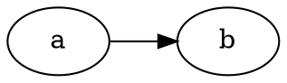
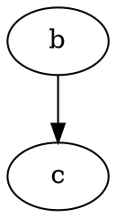

If you want to embed GraphViz graphs (`dot` syntax) into your Markdown documents, you can use [fenced code blocks](https://www.markdownguide.org/extended-syntax/#syntax-highlighting) and some JavaScript to make this happen.

First, add the following script setup to the end of your template `<body>`. This brings in [`d3.js`](https://github.com/d3/d3), [`d3-graphviz.js`](https://github.com/magjac/d3-graphviz), and [`hpcc-js/wasm`](https://github.com/hpcc-systems/hpcc-js-wasm) as dependencies, and adds a tiny shim to generate graphs from all `.language-dot` elements.

```html
<script src="https://unpkg.com/d3@5.16.0/dist/d3.min.js"></script>
<script src="https://unpkg.com/@hpcc-js/wasm@0.3.11/dist/index.min.js"></script>
<script src="https://unpkg.com/d3-graphviz@3.1.0/build/d3-graphviz.min.js"></script>
<script>
  function d3ize(elem) {
    var par = elem.parentElement;
    d3.select(par).append('div').graphviz().renderDot(elem.innerText);
    d3.select(elem).style('display', 'none');
  }
  console.log(document.getElementsByClassName(".language-dot"));
  var dotelems = document.getElementsByClassName("language-dot");
  for (let elem of dotelems) {
    d3ize(elem);
  }
</script>
```

Example markdown for graph #1:

````markdown

````


Example markdown for graph #2:

````markdown

````



The `d3-graphviz` output SVG can be interacted with, so if you want to expand the viewing area you can do some back-calculation from the parent:

```javascript
d3.select(par).append('div').attr('class', 'graphviz-svg').graphviz().width(
  par.clientWidth - 3 * parseFloat(getComputedStyle(par).fontSize)
).renderDot(elem.innerText);
```

The `3` multiplier assumes a style where the total margin/padding on each side is `1.5em`. Tweak for your styles.
